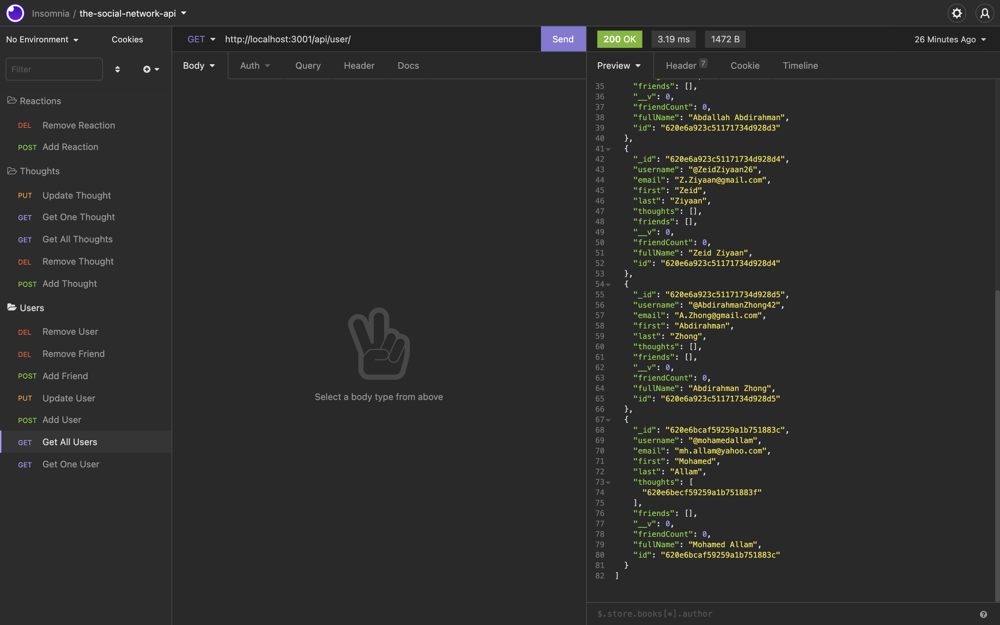

# the-social-network-api
An API / Backend for a social network that performs various functions on a NoSQL database (MongoDB).

[](https://github.com/DAVFoundation/captain-n3m0/blob/master/LICENSE)



## Table of Contents

* [Technologies](#technologies)
* [Installation](#installation)
* [Feature](#feature)
* [Usage](#usage)
* [License](#license)
* [Questions](#questions)
* [Screens](#screens)


## Technologies 

* JavaScript ES6
* Node.js
* ExpressJS
* npm
* MongoDB
* Mongoose
* Insomnia
* Nodemon

## Installation 

Following are the steps of installation

```
npm i
```

## Features

* Models for users, throughts (posts) and reactions (comments/replies), handled with Mongoose on MongoDB NoSQL database
* Organized ExpressJS request handling via routers
* Use of nodemon for saving and refreshing server instantly

## Usage 

Unrestricted usage.


## License 

MIT

## Screens

This following gif shows the whole journey of the application.

Check video for demonstartion [here](https://youtu.be/C2FjFK7jcA8)

## Questions 

If you have any more questions, please contact me here:

Github Username: [mohamedallam13](https://github.com/mohamedallam13)

Email: [mohamedallam.tu@gmail.com](mailto:mohamedallam.tu@gmail.com)


